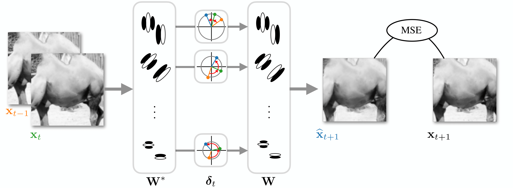
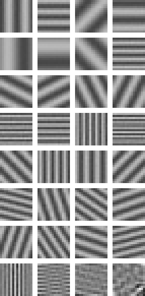
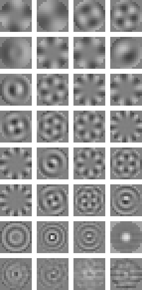

# Polar Prediction Model

Implementation of **[A polar prediction model for learning to represent visual transformations](https://arxiv.org/abs/2303.03432)**, pulished at NeurIPS 2023.



A minimal and self-contained pytorch example is provided in ``notebooks/tutorial.ipynb``. Below are instructions to reproduce the results described in the paper.

## Install

```bash
git clone https://github.com/pehf/PolarPrediction.git
cd PolarPrediction
conda env create -f environment.yml
conda activate ppm
pip install -e .
```

## Usage

### Data

To download the datasets, run:
```bash
bash data/download.sh
```
Data will be stored in ``~/Documents/datasets/``.

### Training

The code is setup to run on a SLURM cluster. To train the models, run:
```bash
bash slurm/NeurIPS23/all.sh
```

To view learning curves (and weights) in Tensorboard, run: 
```bash
tensorboard --logdir checkpoints/
```

### Results 

Performance results and example predictions are gathered in ``notebooks/consolidate.ipynb``.

Note that to run notebooks, jupyterlab is required and can be installed by running:
```bash
pip install jupyterlab
```

## Citation

```bibtex
@inproceedings{fiquet2023polar,
  title={A polar prediction model for learning to represent visual transformations},
  author={Fiquet, Pierre-{\'E}tienne H and Simoncelli, Eero P},
  booktitle={Thirty-seventh Conference on Neural Information Processing Systems},
  year={2023}
}
```

## Visualization

Animation of two sets of filters, trained on synthetic data consisting respectively of translations, and of rotations of image.



